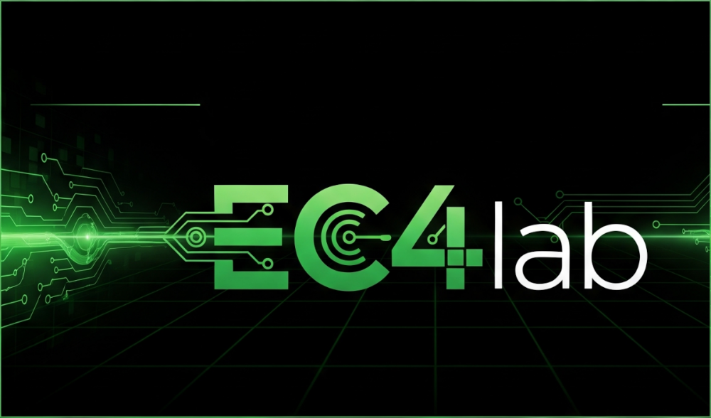

# Somos EC4lab

Este proyecto es es un espacio para que todos podamos experimentar y desarrollar dispositivos electrónicos, sofware y automatizaciones en la infustria y el hogar. Estamos abiertos a explorar todo tipo de dispositivos y plataformas.

¡Nos encantaría que te unas a nosotros! Puedes colaborar con ideas, proyectos, información, traducciones o cualquier cosa que creas que pueda ayudar a que el proyecto y la comunidad crezcan.

No importa si eres un experto desarrollador o si apenas logras encender una computadora, nuestra documentación está pensada para que cualquier persona, sin importar su nivel de conocimiento, pueda llevar a cabo los proyectos. Aquí encontrarás todas las herramientas necesarias para la implementación.

¡Te esperamos con los brazos abiertos!

|**DISCLAIMER**|
|:---:|
|Toda la documentación que ves aqui es una recopilación de recursos de internet y experiencias propias puramente con fines didácticos, si encuentras algún error o conoces una mejor forma de realizar los proyectos no dudes en contactarnos. El uso de estos recursos y su implementación en ambitos por fuera de lo educativo queda bajo su responsabilidad.|

# Nuestros proyectos
Utilizar markdown

Primeros pasos con git y github

Domotica - HomeAssistant

Robotica

Arduino

## 📝 Licencia

Este proyecto está licenciado bajo la Licencia MIT.  
Podés usar, copiar, modificar y distribuir el software libremente, siempre que incluyas el aviso de derechos de autor original.

Para más información, consultá el archivo [LICENSE](LICENSE).

## 📫 Contacto

**EC4lab**  
[GitHub: ec4lab](https://github.com/ec4lab)  
[email: ec4lab@gmail.com](ec4lab@gmail.com)

---
