# ESPhome
[ESPHome](https://esphome.io/), es una plataforma que te permite crear tus dispositivos domóticos de manera simple a partir de dispositivos ESP32 y ESP8266.


>Toda la documentación que ves aqui es una recopilación de recursos de internet y experiencias propias puramente con fines didácticos, si encuentras algún error o conoces una mejor forma de realizar los proyectos no dudes en contactarnos. El uso de estos recursos y su implementación en ambitos por fuera de lo educativo queda bajo tu responsabilidad.


## Instalar el complemento

## Flashear dispositivos
Si bien es posible flasher dispositivos directamente conectados a la raspberry pi que contiene home assistant [ESPHome](https://esphome.io/), tiene una plataforma online [WEB ESPHome](https://web.esphome.io/) que permite no solo flashear un dispositivo cuando no tenemos acceso físico a nuestro servidor sino que ni siquiera es necesario tener acceso a home assistant para grabarlo o utilizarlo.

> web esphome
[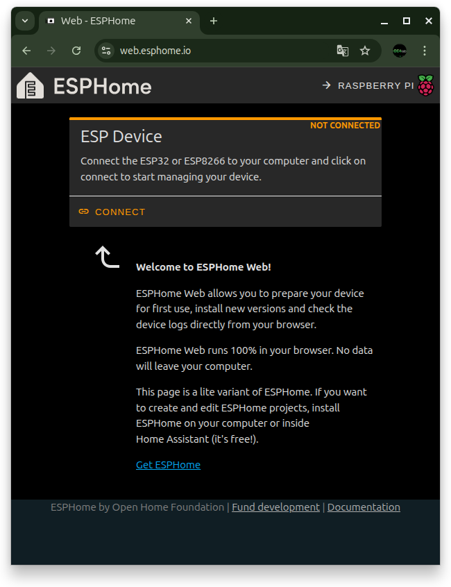](https://web.esphome.io/)

Tener en cuenta que ESPHome web no funciona con todos los exploradores, hasta ahora solo nos ha funcionado chrome.

### ESP8266 - Wemos D1 Mini
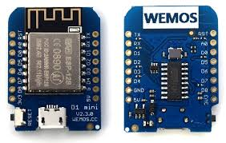
Es uno de los más sencillos, normalmente no trae problemas.

Primero debemos conectar la placa al usb de nuestra pc.
Luego click en CONNECT y seleccionamos el puerto.  

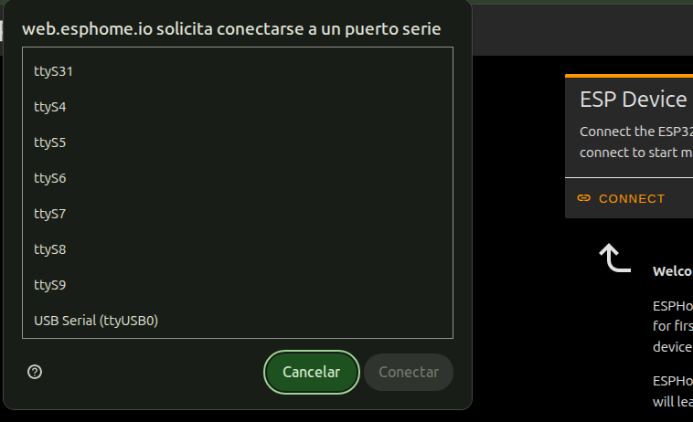

**💡tip**: si aparecen muchos puedes conectar y desconectar la placa y ver cual aparece y desaparece

Luego clich en **PREPARE FOR FIRST USE** y luego en la ventana emergente: **INSTAL**  

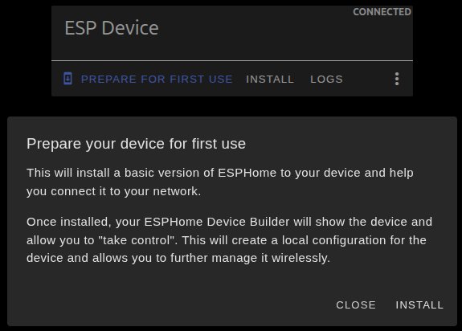

Esperamos que termine de instalar

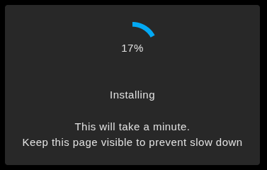

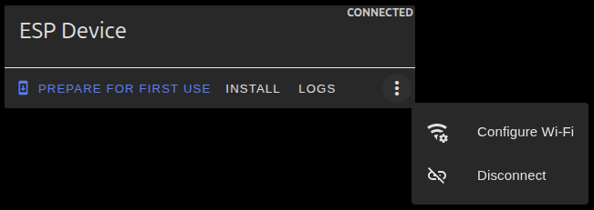

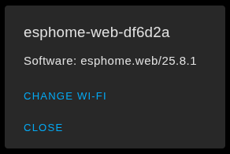

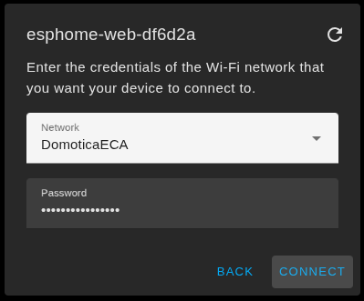

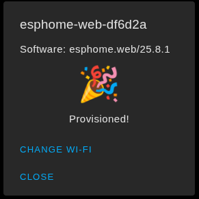

Listo!

Luego en el complemento ESPHOME en Home Assistant:
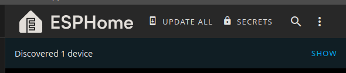
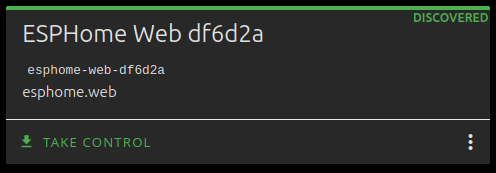
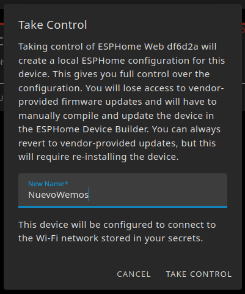
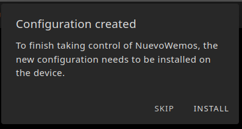


SKIP!

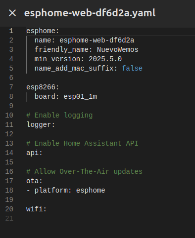  

agregamos en el apartado wifi:

```yaml
wifi:
  use_address: esphome-web-df6d2a
  networks:
  # Red Principal
  - ssid: !secret wifi1_ssid
    password: !secret wifi1_password
  
  # Red Secundaria
  - ssid: !secret wifi2_ssid
    password: !secret wifi2_password
  
  # SSID y Pass del captive portal
  ap:
    ssid: "Fallback NuevoWemos"
    #password: "123456789" #Opcional
```

es muy importante **use_address**

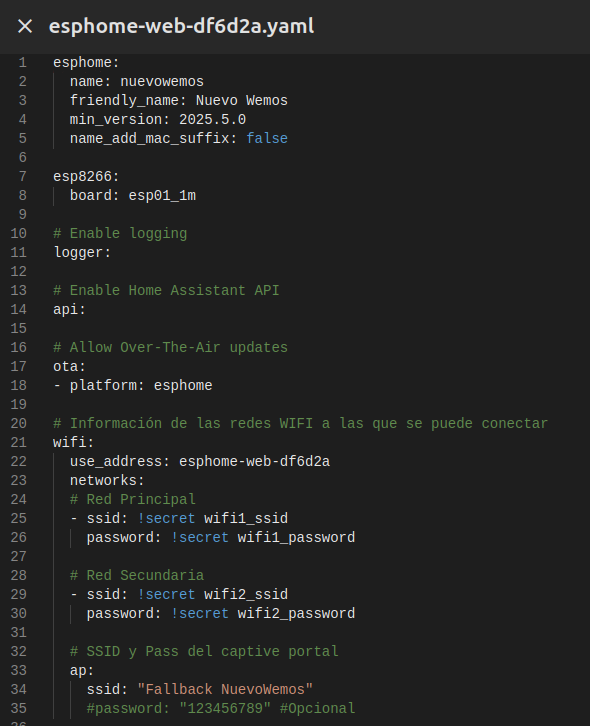 

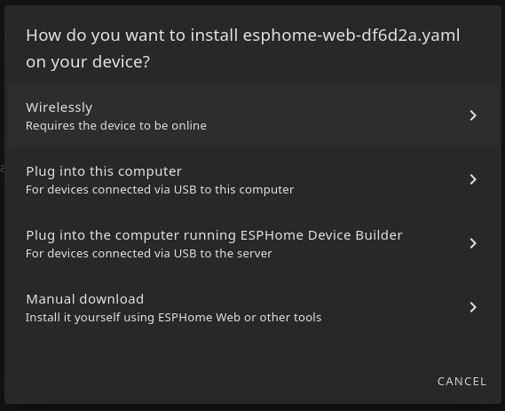 

instalar wiresly

una vez compilado y cargado no va a lograr conectarse, porque está buscando el nombre antigüo, asi que cerramos, pero en el tablero ya lo vamos a ver online, debemos volver a editar el yaml y comentar la línea de `use_address`, solo la volveremos a usar si cambiamos el nombre del dispositivo.

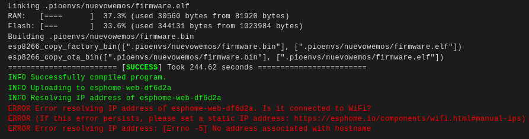 


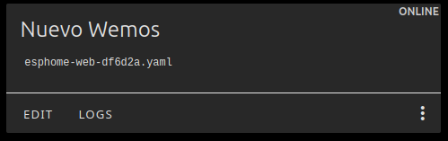 

```yaml
...
# Información de las redes WIFI a las que se puede conectar
wifi:
  #use_address: esphome-web-df6d2a
  networks:
  # Red Principal
  - ssid: !secret... 
```
Listo, ya hemos cambiado el `nombre` y el `nombre amistoso`, también podemos editar el nombre del archivo, para esto usamos file editor.

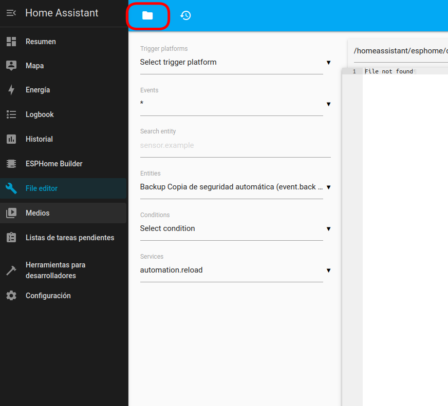

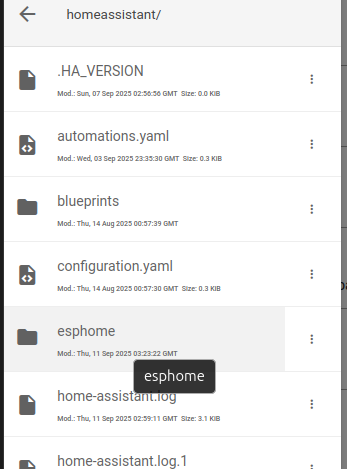 

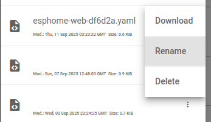 

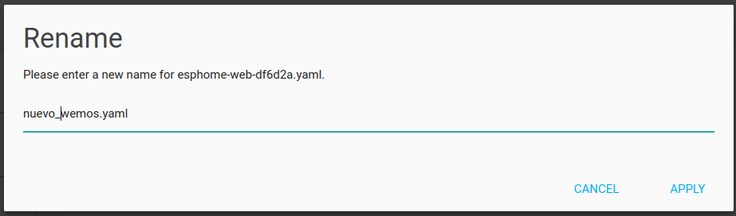 

Será necesario reinstalar luego de cambiar el nombre del archivo.

listo!

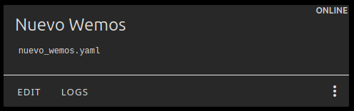 

## 📫 Contacto

**EC4lab**  
[GitHub: ec4lab](https://github.com/ec4lab)  
[email: ec4lab@gmail.com](ec4lab@gmail.com)

---
